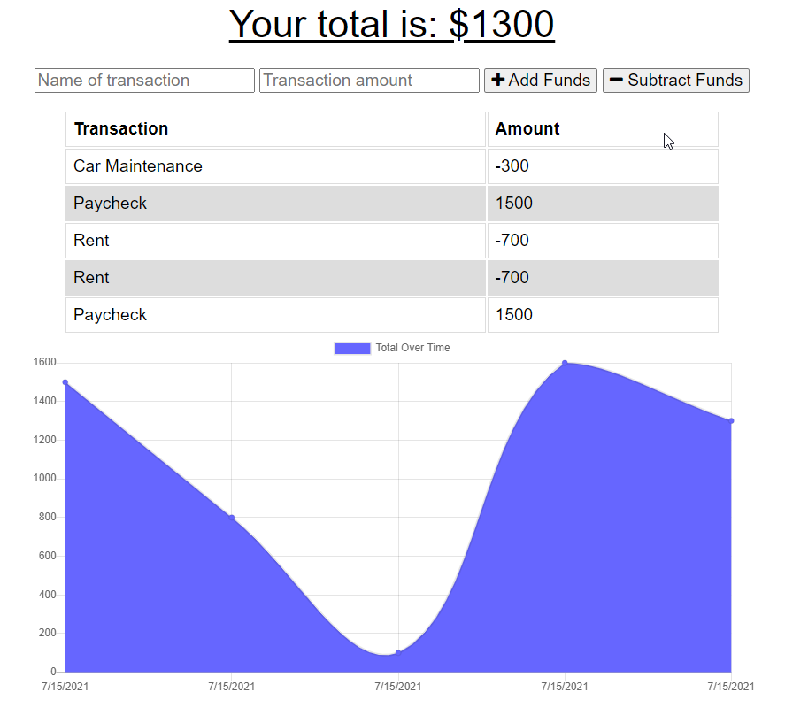
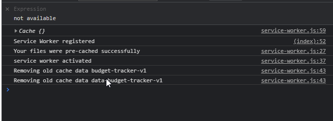
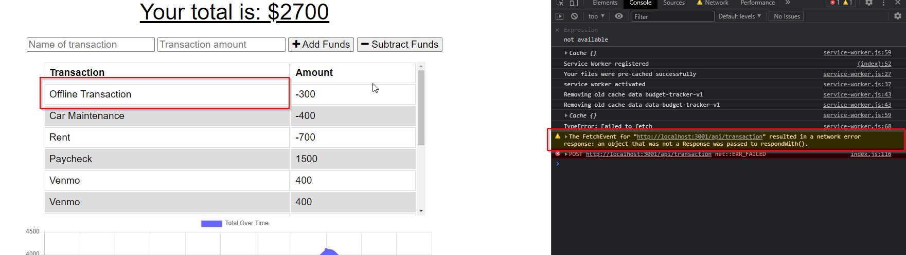
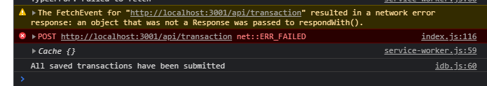
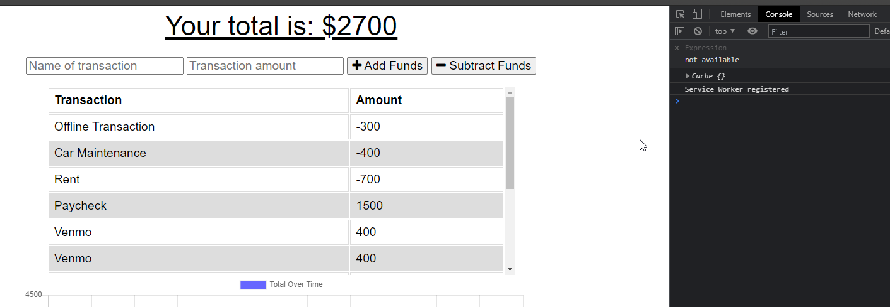

 # Budget Tracker 

  ## About/Description

  This project is a budget tracker app.  As users will need to be able to add transactions no matter the their internet connection.  In order to meet this user need, this application is setup as a PWA so users can access this from their phone or computer.  Users can add an icon to their homescreen with this application as it acts similar to a native application. It also utilizes IndexDB to store transactions if the user is offline and adds those transactions when the user re-connects to the internet.

  ## Table of Contents

  * [Installation](#installation)
  * [Usage](#usage)
  * [Languages](#languages)
  * [Contributing](#contributing)
  * [License](#license)
  * [Tests](#tests)
  * [Questions](#questions)
  
  ## Installation

  This application is loaded to Heroku so no special actions are needed to run this application.  Users can open this application from their phone and add it with an icon to their screen with the Add to Home Screen from their phones.

  ## Usage

  ### Screenshots

  #### Homepage loaded with previous transactions saved

  

  #### Service Worker function on page load

  

  #### Offline Transaction being submitted

  

  #### Transaction saved to IndexDB then to the DB after coming back online

  

  #### Refreshing the page after coming back online, shows the transaction was saved

  

  ## Languages

  JavaScript HTML CSS IndexDB Service Worker Mongoose

  ## Contributing

  Contributions by: David Shaw

  If you would like to contribute to this project we follow the [Contributor Covenant](https://www.contributor-covenant.org/)

  ## License

  https://choosealicense.com/licenses/mit/

  ## Tests

  Opening Chrome DevTools will allow you to turn the application offline and test the IndexDB functionality.

  ## Questions:

  If you have any questions please contact us or refer to our github below:

  Email Us At: david.shaw1242@gmail.com

  Github Repo: https://github.com/ds1242/budget-tracker-pwa
